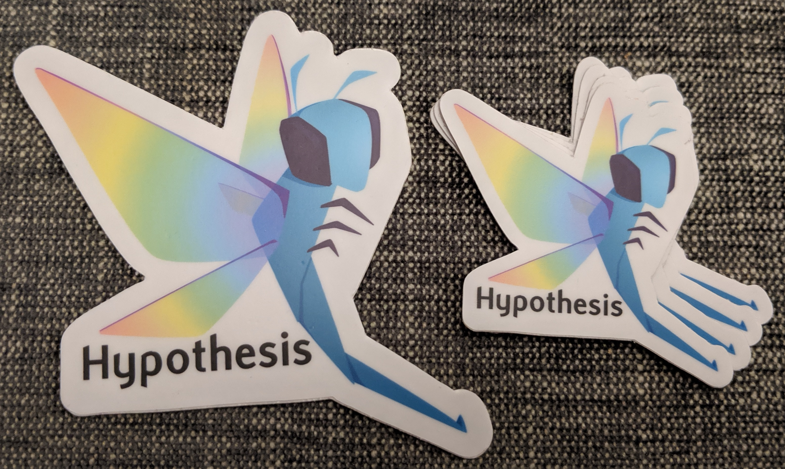

Logos and other pretty things
=============================

Hypothesis has a beautiful logo, thanks to the generous work of Libby Berrie
in `issue #1519 <https://github.com/HypothesisWorks/hypothesis/issues/1519>`__.
The `CogWorks class of 2019 <https://github.com/CogWorksBWSI>`__ named the
dragonfly "Scout", as a job description and after *To Kill a Mockingbird*.

General guidelines:

- Prefer vector (``.svg``) formats to raster formats (``.png``) wherever possible.
  However, some viewers don't handle the layers well - e.g. the left eye might be
  drawn in front of the head - in which case you might prefer ``.png``.
- We consider the rainbow version to be canonical.  The blue variant is provided
  for cases such as monochome versions or printing with a limited palette.

With that in mind, you are welcome to use these logos to refer to Hypothesis -
and if you're not sure whether a specific use is OK, please get in touch and ask!

For example, we often bring Hypothesis stickers to conferences but can't make
it to everything.  If you want to print your own Hypothesis stickers, upload
``sticker.png`` to `StickerMule <https://www.stickermule.com/custom-stickers>`__
and pick one of the die-cut vinyl options - that's how we get ours!

Zac also hands out `custom hard-enamel pins <./pin.jpg>`__ to Hypothesis contributors,
including anyone who has a pull request merged, does outreach, attends a paid workshop,
donates money, and so on - we value all kinds of contributions!

Like stickers, you can collect a pin in person at certain Python conferences, or
`sponsor Zac <https://github.com/sponsors/Zac-HD/>`__ to get them by Australia Post.

Colour palette in GIMP format
#############################

A `colour palette in GIMP format <hypothesis.gpl>`__ (``.gpl``) is also provided
with the intent of making it easier to produce graphics and documents which
reuse the colours in the Hypothesis Dragonfly logo by Libby Berrie.

The ``hypothesis.gpl`` file should be copied or imported to the appropriate
location on your filesystem. For example:

- ``/usr/share/inkscape/palettes/`` for Inkscape on Ubuntu 18.08
- Edit -> Colors -> Import... then select the ``hypothesis.gpl`` file in Scribus
  on Ubuntu 18.08
- Windows -> Dockable Dialogs -> Palettes -> Palettes Menu -> Add Palette ->
  Import from file... then select the ``hypothesis.gpl`` file in GIMP on Ubuntu
  18.08

Once imported, the colour palette is then available for easy manipulation of
colours within the user interface.

Inkscape:

.. image:: inkscape.png
    :width: 800px
    :align: left
    :alt: Inkscape showing Hypothesis colour palette

GIMP:

.. image:: gimp.png
    :width: 800px
    :align: left
    :alt: GIMP showing Hypothesis colour palette
