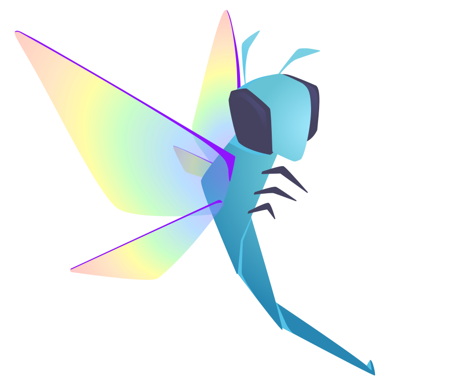

=========
Community
=========

The Hypothesis community is small for the moment but is full of excellent people
who can answer your questions and help you out. Please do join us.
The major place for community discussion is `the mailing list <https://groups.google.com/forum/#!forum/hypothesis-users>`_.

Feel free to use it to ask for help, provide feedback, or discuss anything remotely
Hypothesis related at all.  If you post a question on Stack Overflow, please use the
`python-hypothesis <https://stackoverflow.com/questions/tagged/python-hypothesis>`__ tag!

Please note that :gh-file:`the Hypothesis code of conduct <CODE_OF_CONDUCT.rst>`
applies in all Hypothesis community spaces.

If you would like to cite Hypothesis, please consider :gh-file:`our suggested citation <CITATION.cff>`.

If you like repo badges, we suggest the following badge, which you can add
with reStructuredText or Markdown, respectively:

.. image:: https://img.shields.io/badge/hypothesis-tested-brightgreen.svg

.. code:: restructuredtext

    .. image:: https://img.shields.io/badge/hypothesis-tested-brightgreen.svg
       :alt: Tested with Hypothesis
       :target: https://hypothesis.readthedocs.io

.. code:: md

    

Finally, we have a beautiful logo which appears online, and often on stickers:

As well as being beautiful, dragonflies actively hunt down bugs for a living!
You can find the images and a usage guide in the :gh-file:`brand` directory on
GitHub, or find us at conferences where we often have stickers and sometimes
other swag.
